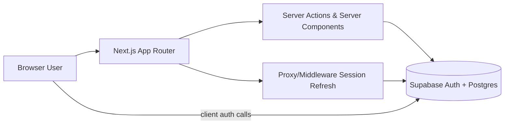

# App Architecture

## 1) Purpose & Scope

This document describes the **current implemented architecture** of the Client Portal app in this repository.

- Product type: multi-tenant agency/client portal
- Tenancy model: one organization per tenant
- Security model: Supabase Auth + PostgreSQL Row-Level Security (RLS)
- Frontend architecture: Next.js App Router with server components + client components

### Related documentation

- Database + security details: [DATABASE_SECURITY_REFERENCE.md](DATABASE_SECURITY_REFERENCE.md)
- RLS verification plan: [RLS_TEST_PLAN.md](RLS_TEST_PLAN.md)

---

## 2) Technology Stack

### Application

- Next.js 16 (App Router)
- React 19 + TypeScript
- Tailwind CSS 4 + shadcn/ui
- TanStack Query (provider configured globally)
- `sonner` for toast notifications

### Backend Platform

- Supabase Auth
- Supabase Postgres
- Supabase SSR helpers (`@supabase/ssr`)

### Deployment Shape

- Frontend: intended for Vercel/Node runtime
- Backend: Supabase project

---

## 3) High-Level System View

### Responsibilities

- **Next.js UI layer**: page composition, protected navigation, interaction flows
- **Server actions**: validated writes + cache revalidation + redirects
- **Supabase**: identity, authorization, data persistence, tenant isolation

---

## 4) Codebase Architecture

## 4.1 Route Groups & Pages

`src/app` is split into route groups:

- `(marketing)`
  - `page.tsx`: public landing page
- `(auth)`
  - `login/page.tsx`: password, magic-link, OAuth login UI
  - `signup/page.tsx`: account + organization onboarding
  - `callback/route.ts`: auth callback/code exchange + post-signup org creation
- `(dashboard)`
  - `layout.tsx`: authenticated shell (sidebar/header), profile/org bootstrap
  - `dashboard/page.tsx`: overview widgets + recent projects
  - `projects/page.tsx`: filtered project listing
  - `projects/[id]/page.tsx`: project detail + member management panel
  - `dashboard/settings/page.tsx`: org settings + team member management (owner-only)

## 4.2 Shared Component Layers

- `src/components/ui/*`: design-system primitives (button, card, sheet, tabs, sidebar, etc.)
- `src/components/shared/*`: feature-aware composites
  - examples: `project-form-sheet`, `project-card`, `member-list`, `org-settings-form`

## 4.3 Data/Infra Utilities

- `src/lib/supabase/server.ts`
  - request-scoped server client
  - service-role client for privileged operations
- `src/lib/supabase/client.ts`
  - browser client for client-side auth actions
- `src/proxy.ts`
  - session refresh and coarse redirect rules
- `src/providers/query-provider.tsx`
  - global TanStack Query client provider

---

## 5) Runtime Architecture & Request Flow

## 5.1 App Shell

Root layout (`src/app/layout.tsx`) composes:

- `ThemeProvider`
- `QueryProvider`
- `TooltipProvider`
- global `Toaster`

Dashboard layout (`src/app/(dashboard)/layout.tsx`):

1. Creates server Supabase client
2. Resolves current user (`auth.getUser`)
3. Redirects unauthenticated users to `/login`
4. Fetches profile + org context (`get_user_organization` RPC)
5. Renders sidebar/header with org + role context

## 5.2 Auth Flows

### Signup

1. User submits details on `signup/page.tsx`
2. `supabase.auth.signUp` stores metadata (`full_name`, `organization_name`)
3. If session exists immediately: create org via `create_organization` RPC
4. If confirmation required: callback route creates org after code exchange

### Login

- Email/password via `signInWithPassword`
- Magic link via `signInWithOtp`
- Google OAuth via `signInWithOAuth`

### Callback

- `callback/route.ts` exchanges code for session
- If user has no org yet, creates one from metadata
- Redirects to next destination (`/dashboard` default)

---

## 6) Data Model (Implemented)

Defined in `supabase/migrations/001_initial_schema.sql`.

### Core tables

- `profiles` (mirror of `auth.users` user identity fields)
- `organizations` (tenant root)
- `organization_members` (user ↔ org membership + role)
- `projects` (org-owned project entities)
- `project_members` (user ↔ project assignment)

### Enums

- `member_role`: `owner`, `team_member`, `client`
- `project_status`: `active`, `review`, `completed`, `on_hold`, `archived`

### Important DB functions

- `create_organization(org_name text)`
- `get_user_organization()`
- `get_my_organization_id()`
- `get_my_org_role(org_id uuid)`
- `is_project_member(project_id uuid)`
- `project_belongs_to_my_org(project_id uuid)`
- `handle_new_user()` trigger function for profile creation

---

## 7) Authorization & Tenant Isolation

## 7.1 Role Model

- `owner`: organization administration, settings, destructive project actions
- `team_member`: project create/update + member assignment
- `client`: restricted read access; limited to assigned projects

## 7.2 RLS Strategy

All core tables have RLS enabled. Policies enforce:

- tenant scoping by `organization_id`
- role-conditional permissions for writes
- client visibility limited through explicit `project_members` linkage

SECURITY DEFINER helper functions are used by policies to avoid recursive policy lookups and centralize access logic.

---

## 8) Server Actions Architecture

Primary action modules:

- `src/app/(dashboard)/projects/actions.ts`
  - create/update/delete project
  - add/remove project members
  - zod validation + `revalidatePath`
- `src/app/(dashboard)/dashboard/settings/actions.ts`
  - org name updates
  - member invite/role update/remove
  - invite flow uses service-role admin API

Pattern used consistently:

1. Validate input (Zod)
2. Resolve auth/session server-side
3. Execute Supabase mutation
4. Revalidate cache paths
5. Return typed result or redirect

---

## 9) Feature Status (Current)

### Implemented

- Marketing page
- Auth (email/password, magic link, OAuth callback path)
- Multi-tenant org creation and membership
- Project CRUD + status filtering
- Project member management
- Organization settings + team management

### Placeholder in UI (not implemented yet)

- Project tasks
- Project chat
- Project file management
- Project activity feed

---

## 10) Operational & Configuration Notes

Environment variables used by app runtime:

- `NEXT_PUBLIC_SUPABASE_URL`
- `NEXT_PUBLIC_SUPABASE_PUBLISHABLE_KEY`
- `SUPABASE_SECRET_KEY` (server-side only)

Security note: service-role usage is isolated to server-only code (`createServiceClient`) and currently used for invitation/admin workflows.

---

## 11) Known Architectural Observations

- Proxy-level route protection currently checks `/dashboard` paths; route-level guards in pages/layout still enforce auth for project pages.
- `projects` routes are top-level (`/projects`) due to route-group behavior, while dashboard root is `/dashboard`; this is intentional in current structure but worth documenting for future IA consistency.
- Query provider is globally available, but current data fetching is mostly server-component driven; client query usage can be expanded as interactive features grow.

---

## 12) Suggested Next Architecture Milestones

1. Add tasks domain (tables + RLS + server actions + UI)
2. Add realtime chat domain (messages table + subscriptions + optimistic UI)
3. Add storage/file domain (bucket policy + metadata table + signed URL flow)
4. Add activity/audit log stream for cross-feature timelines
5. Add observability basics (structured server-action logging + error boundaries)
